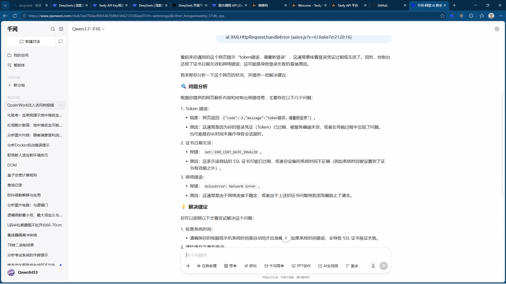
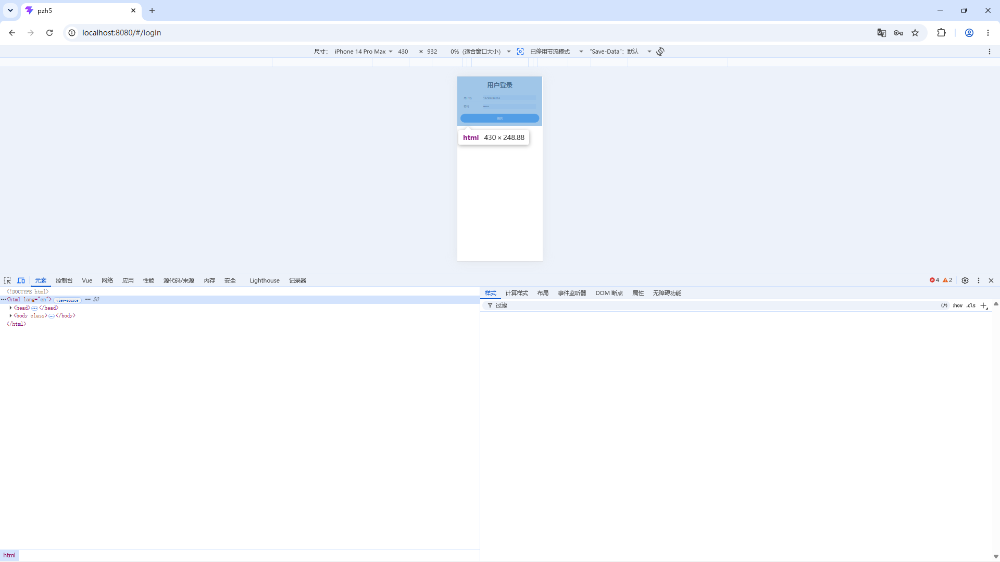
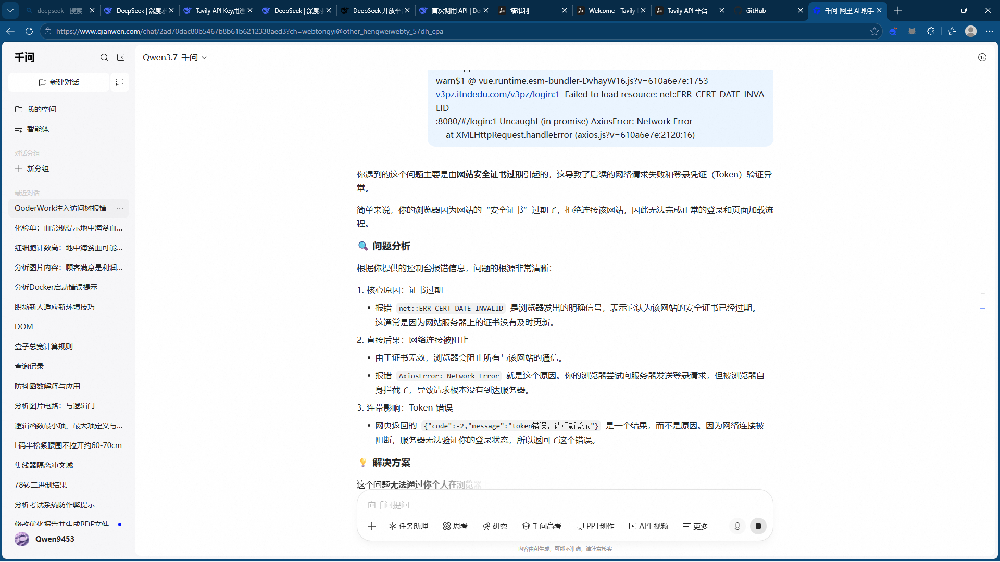
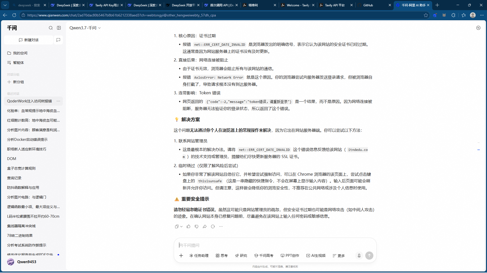

# Helia · AI 智能工作台

> 一个基于 Vue 3 + Pinia 构建的 AI 智能工作台应用，集成了多模型对话、智能体工作流编排、任务调度、RAG 知识库等核心能力。支持 DeepSeek、OpenAI、智谱 GLM、通义千问等多家大模型 API，可可视化编排智能体工作流并实时查看执行状态。

<p align="center">
  
</p>

## ✨ 核心功能

### 💬 多模型智能对话
- **多 Provider 架构**：支持 DeepSeek、OpenAI、智谱 GLM、通义千问、Moonshot、Ollama 等 7+ 服务商，每个 Provider 独立存储 API Key 和 Base URL
- **模型分层**：Flash（轻量快速）、Standard（通用）、Power（强推理）、Local（本地部署）四档模型强度选择
- **流式输出**：SSE 流式响应，实时展示 AI 生成过程
- **联网搜索增强**：集成 Tavily Search API，对话中可一键开启网络搜索，将实时信息注入上下文
- **Markdown 渲染**：支持代码高亮、表格、引用、链接等完整 Markdown 语法，XSS 安全过滤

<p align="center">
  
</p>

### 🤖 可视化工作流编排
- **拖拽式画布**：可视化编辑智能体工作流，支持节点拖拽、连线、缩放、全屏
- **多节点类型**：智能体节点、工具节点（Web 搜索 / 代码执行 / 知识库检索）、IO 输入输出节点
- **实时执行面板**：工作流执行时实时显示每个节点的运行状态、输入输出、耗时，支持输出展开/收起
- **多工作流管理**：支持创建、重命名、复制、删除多个工作流，独立画布和持久化
- **智能体管理**：8 个预设智能体（研究助理、代码评审、日文邮件、日程调度等），支持自定义创建、导入导出

<p align="center">
  
</p>

### 📋 任务调度系统
- **定时任务**：支持每日 / 每周定时触发智能体任务
- **并发控制**：最大 2 个并发执行，超出任务排队等待
- **任务生命周期**：创建 → 排队 → 执行 → 完成 / 失败 / 取消
- **自动清理**：24 小时自动清理过期的定时任务副本

<p align="center">
  
</p>

### 📚 RAG 知识库
- **多来源导入**：支持文件上传（.txt / .md）、手动文本、网页链接三种导入方式
- **自动分块**：按段落自动分块，支持关键词检索（无需向量模型）
- **上下文注入**：对话时自动检索知识库命中片段，注入 AI 上下文
- **引用统计**：记录每个文档的引用次数，量化知识库使用情况
- **安全高亮**：搜索结果关键词高亮，防 XSS，多关键词合并正则避免 HTML 破损

<p align="center">
  
</p>

### ⚙️ 系统设置
- **Provider 管理**：可视化配置多个 AI 服务商，独立 API Key / Base URL
- **模型刷新**：一键从 API `/models` 端点拉取供应商所有可用模型
- **搜索 API 配置**：Tavily 搜索 API Key 配置
- **存储诊断**：localStorage 使用量监控，配额溢出降级保护
- **主题切换**：亮色 / 暗色主题

<p align="center">
  
</p>

## 🏗️ 技术架构

### 技术栈

| 技术 | 版本 | 用途 |
|------|------|------|
| Vue 3 | ^3.4.27 | 前端框架（Composition API + `<script setup>`） |
| Pinia | ^2.1.7 | 状态管理（自定义 persist 持久化插件） |
| Vue Router 4 | ^4.3.2 | 路由管理（Hash 模式） |
| Vite | ^5.2.11 | 构建工具 |
| Tailwind CSS | ^3.4.4 | 原子化 CSS |

### 项目结构

```
ai-workbench/
├── src/
│   ├── components/           # 通用组件
│   │   ├── AppSidebar.vue    # 侧栏（会话列表、重命名）
│   │   ├── AppTopbar.vue     # 顶栏（模型选择、Provider 切换）
│   │   ├── BaseModal.vue     # 模态框基础组件
│   │   ├── ConfirmDialog.vue # 确认对话框
│   │   ├── Icon.vue          # SVG 图标组件
│   │   └── workflow/         # 工作流组件
│   │       ├── WorkflowCanvas.vue  # 画布（节点拖拽、连线）
│   │       ├── NodeLibrary.vue     # 节点库面板
│   │       └── NodeInspector.vue   # 节点属性检查器
│   ├── views/                # 页面视图
│   │   ├── ChatView.vue      # 对话页面
│   │   ├── AgentsView.vue    # 智能体工作流页面
│   │   ├── TasksView.vue     # 任务调度页面
│   │   ├── KnowledgeView.vue # 知识库页面
│   │   └── SettingsView.vue  # 设置页面
│   ├── stores/               # Pinia 状态管理
│   │   ├── chat.js           # 对话 store（消息、流式、搜索增强）
│   │   ├── agents.js         # 智能体 store（CRUD、运行日志）
│   │   ├── workflow.js       # 工作流 store（拓扑排序、执行引擎）
│   │   ├── tasks.js          # 任务 store（并发控制、状态机）
│   │   ├── knowledge.js      # 知识库 store（分块、检索、上下文）
│   │   ├── settings.js       # 设置 store（多 Provider、模型管理）
│   │   ├── ui.js             # UI 状态 store
│   │   ├── toast.js          # Toast 通知 store
│   │   └── persist.js        # 自定义 localStorage 持久化插件
│   ├── services/             # 业务服务层
│   │   ├── ai.js             # AI 服务（chatOnce / streamChat / localFallback）
│   │   ├── tools.js          # 工具服务（web_search / code_exec / knowledge）
│   │   └── scheduler.js      # 定时任务调度器
│   ├── utils/                # 工具函数
│   │   └── markdown.js       # Markdown 渲染（XSS 安全）
│   ├── directives/           # 自定义指令
│   │   └── clickOutside.js   # 点击外部关闭指令
│   ├── router/               # 路由配置
│   └── styles/               # 全局样式
├── index.html
├── vite.config.js
├── tailwind.config.js
├── postcss.config.js
└── package.json
```

### 架构亮点

**1. 多 Provider 模型架构**
- `settings.js` 中 `providers` 数组管理多个 AI 服务商配置
- 模型映射 key 格式 `${providerId}:${modelName}`，支持模型分层（flash / standard / power / local）
- `PRESETS` 内置 7 家主流厂商的完整模型列表
- 旧数据自动迁移：检测 localStorage 旧格式并升级为多 Provider 结构

**2. 工作流执行引擎**
- 拓扑排序（BFS）确定节点执行顺序
- Vue 3 响应式代理访问：通过 `this.runs.find()` 获取 Proxy 对象确保 UI 实时更新
- 工具节点使用原始输入（`originalInput`）避免上下文污染
- `AbortController` 支持中途停止工作流

**3. 自定义 Pinia 持久化插件**
- `persist.js` 实现 `localStorage` 自动持久化
- 支持字段级持久化配置：`persist: ['field1', 'field2']`
- 配额溢出降级保护：超出 `QuotaExceededError` 时自动切换内存模式
- 150ms 防抖写入，避免高频操作性能问题

**4. RAG 知识库无副作用检索**
- `_searchInternal()` 纯查询方法供 `buildContext()` 使用
- `search()` 带副作用方法仅供 UI 交互使用
- 避免聊天注入上下文时污染知识库页面的搜索状态

## 🚀 快速开始

### 环境要求

- Node.js >= 18
- npm / pnpm

### 安装运行

```bash
# 克隆仓库
git clone https://github.com/Phoenix-svg12/helia-ai-workbench.git
cd helia-ai-workbench

# 安装依赖
npm install

# 启动开发服务器
npm run dev

# 构建生产版本
npm run build
```

### 配置 AI 服务

1. 打开应用后进入 **设置 → AI 服务**
2. 选择服务商（如 DeepSeek），填写 API Key 和 Base URL
3. 可选：配置搜索 API Key（Tavily）以启用联网搜索
4. 在顶栏选择模型和模型强度

> 未配置 API Key 时，应用自动进入本地演示模式，使用模拟回复并明确提示。

## 🔧 配置说明

### 支持的 AI 服务商

| 服务商 | Base URL | 模型示例 |
|--------|----------|----------|
| DeepSeek | `https://api.deepseek.com` | deepseek-chat, deepseek-reasoner |
| OpenAI | `https://api.openai.com/v1` | gpt-4o, gpt-4o-mini |
| 智谱 GLM | `https://open.bigmodel.cn/api/paas/v4` | glm-4-plus, glm-4-flash |
| 通义千问 | `https://dashscope.aliyuncs.com/compatible-mode/v1` | qwen-max, qwen-plus |
| Moonshot | `https://api.moonshot.cn/v1` | moonshot-v1-8k, moonshot-v1-32k |
| Ollama | `http://localhost:11434/v1` | llama3, qwen2.5 |
| 自定义 | 任意 OpenAI 兼容 API | 任意模型 |

### 网络搜索配置

应用集成了 [Tavily Search API](https://tavily.com/) 用于联网搜索：

1. 注册 Tavily 账号获取 API Key
2. 在 **设置 → AI 服务** 中填写搜索 API Key
3. 对话时点击"网络搜索"按钮开启

> 工作流中的「Web 搜索」工具节点也使用同一 API Key，且使用原始用户输入而非被前序节点污染的上下文。

## 📖 功能详解

### 对话系统
- 流式 AI 回复，实时展示生成过程
- 消息编辑后重新发送，保留上下文
- 重新生成回复，在原位置插入而非追加到末尾
- 导出对话为 Markdown 文件
- 附件支持（文件拖拽）
- 智能体切换，每个智能体有独立的 system prompt 和 temperature

### 工作流编排
- 拖拽节点库中的智能体 / 工具到画布
- 拖拽节点端口创建连线
- 点击节点查看和编辑属性（NodeInspector）
- 执行时画布实时高亮当前节点（紫色脉冲）和已完成节点（绿色边框）
- 执行记录面板支持输出展开 / 收起

### 任务调度
- 每日 / 每周定时触发
- 手动立即执行
- 并发控制（maxConcurrent = 2）
- 任务状态机：queued → running → done / failed / cancelled

### 知识库
- 文件上传（.txt / .md）
- 手动添加文本
- 网页链接添加（URL 格式验证，防 XSS）
- 自动段落分块
- 关键词检索（无向量模型依赖）
- 检索结果高亮

## 🔒 安全特性

- **Markdown XSS 过滤**：链接 URL 协议白名单（仅允许 http(s) / mailto / tel）
- **知识库 URL 验证**：仅允许 http(s) 协议，拒绝 javascript: / data:
- **HTML 实体保护**：高亮替换前用占位符保护 HTML 实体
- **代码块保护**：代码块内容延迟到行内格式化后还原，避免代码被错误格式化
- **API Key 本地存储**：所有 API Key 仅存储在浏览器 localStorage，不上传任何服务器

## 📄 License

[MIT](./LICENSE) © 2026 Phoenix-svg12
